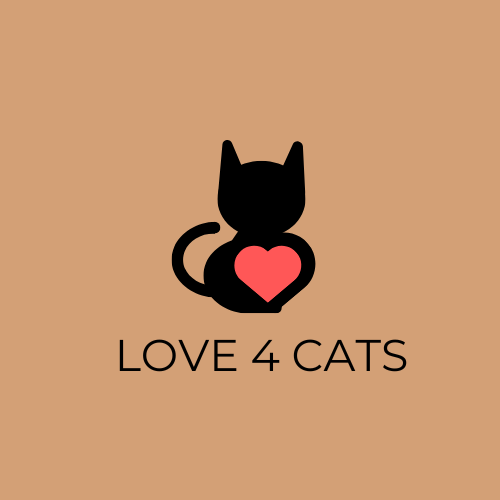

# Love 4 Cats

Visit the deployed site: [Love4Cats](https://shezmoin.github.io/Love4cats/index.html)

Welcome to Love 4 Cats, a beautifully designed website dedicated to cat lovers! This website showcases various aspects of feline love, from cat care tips to adorable pictures and more.

A place for cat lovers to connect, learn, and celebrate our feline friends! Whether you're looking for expert care tips, adorable cat stories,
or a community that shares your passion, you've found your purr-fect home. 

## Table of Contents

* Project Overview
* Features
* Technologies Used
* Typography
* Design and Color Scheme
* Features
* Accessibility
* Testing
* Credits
* Media Used

## Project Overview

The Love 4 Cats website is designed to provide cat enthusiasts with a platform to explore various cat-related content. The website includes sections for cat care, adoption, galleries, and community engagement.

## Features

* Home Page: A welcoming page with a beautiful banner and introduction.
* About Us: Information about the purpose of the website.
* Gallery: A collection of adorable cat pictures.
* Adoption Section: Details about cat adoption and how to adopt a furry friend.
* Contact Form: A form to get in touch with the team.
* Responsive Design: Mobile-friendly layout using HTML and CSS.

## Technologies Used

* HTML5: Structure and content of the website.
* CSS3: Styling and layout enhancements.
* JavaScript: Added for interactive elements.

## Typography

The website uses 'dancing-script', cursive as the primary font, ensuring readability and a clean, modern look. Text elements such as headers and paragraphs are well-spaced to enhance the user experience.

## Design and Color Scheme

* Primary Colors: Soft pastel colors and warm tones to reflect the friendly and comforting nature of cats.
* Background: A fixed, full-screen background image that enhances the site's aesthetic appeal.
* Navigation: The sidebar features a dark background with light-colored text for contrast and easy navigation.

## Features

* Responsive Design: The site is set to adapt to different screen sizes 
* Sidebar Navigation: Easy access to various sections of the website.
* Engaging Content: Information on why people love cats, an image gallery, and a video section.
* Registration Form: Allows users to register to sponsor, foster or adopt through the Love4Cats community.
* Social Media Integration: Links to Facebook, Twitter, Instagram, and Wikipedia for expanded engagement.

## Accessibility

* Color Contrast: Ensures readability for users with visual impairments.
* Alt Text: Added to images for screen readers and visually impaired users.
* Keyboard Navigation: Navigation links and forms are accessible via keyboard input.

## Testing

The website has been tested on multiple devices and browsers to ensure compatibility and responsiveness:
* Browsers Tested: Chrome, Firefox, Edge
* Devices Tested: Desktop
* Validation Tools Used: HTML and CSS validators to check for errors and accessibility compliance.

## Media Used

* Images: Background image and cat-related images sourced from royalty-free platforms.
* Videos: Embedded or linked from reputable sources such as YouTube or user-submitted content.
Credits
* Developer: Shehzad Moin
* Icons: FontAwesome for social media icons
* External Libraries: FontAwesome Kit for social media icons

## Usage

* Open the index.html file in a browser to view the website.
* Navigate through different sections using the menu.
* Explore cat-related content and images.
* Use the contact form to send messages.

## File Structure

Love4Cats/

│-- index.html

│-- servicesweoffer.html

│-- gallery.html

│-- whylovecats.html

│-- form.html

│-- assets/

│   ├── images/

│   ├── css/

* index.html: Main page of the website.
* gallery.html: Gallery section.
* form.html: Registration forms..
* assets/: Contains images, CSS.

## Contact

For any inquiries, feel free to reach out:
●	Email: contact@love4cats.com
●	Website: Love 4 Cats

Happy Cat-Loving! 🐱
