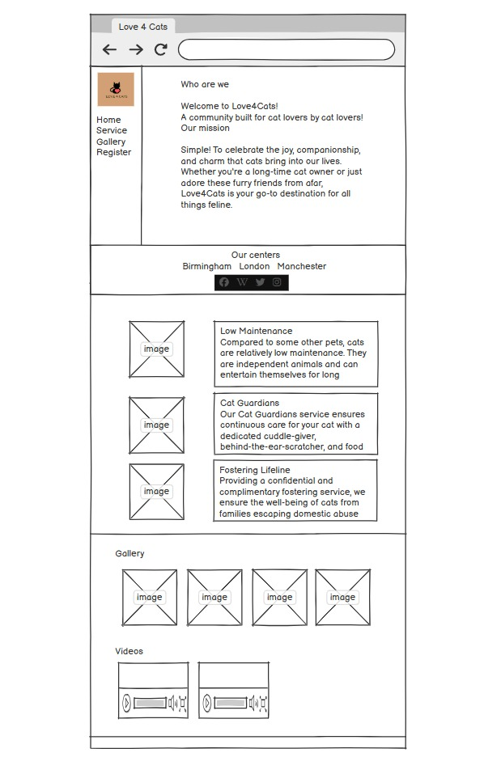

# Love 4 Cats

Visit the deployed site: [Love4Cats](https://shezmoin.github.io/Love4cats/index.html)

Welcome to Love 4 Cats, a beautifully designed website dedicated to cat lovers! This website showcases various aspects of feline love, from cat care tips to adorable pictures and more.

## Project Overview
The Love 4 Cats website is designed to provide cat enthusiasts with a platform to explore various cat-related content. The website includes sections for cat care, adoption, galleries, and community engagement.

## Features & Design
Home Page: A welcoming page with a beautiful banner and introduction.

About Us:Information about the purpose of the website.

Gallery: A collection of adorable cat pictures.

Adoption Section: Details about cat adoption and how to adopt a furry friend.

Contact Form: A form to get in touch with the team.

Responsive Design: Mobile-friendly layout using HTML and CSS.

* ###  Technologies Used

     HTML5: Structure and content of the website.
  
     CSS3: Styling and layout enhancements.
  
     JavaScript (Optional): Can be added for interactive elements.

* ### Typography

      Fonts 

  The website uses 'dancing-script', cursive as the primary font, ensuring readability and a clean, modern look. Text elements such as headers and paragraphs are well-spaced to enhance the user experience

      Icons

  FontAwesome for social media icons

      External Libraries

  FontAwesome Kit for social media icons

* ### Design and Color Scheme

     Primary Colors: Soft pastel colors and warm tones to reflect the friendly and comforting nature of cats.

     Background: A fixed, full-screen background image that enhances the site's aesthetic appeal.

     Navigation: The sidebar features a dark background with light-colored text for contrast and easy navigation.

* ### Features

   Responsive Design: The site is set to adapt to different screen sizes 

   Sidebar Navigation: Easy access to various sections of the website.

   Engaging Content: Information on why people love cats, an image gallery, and a video section.

   Registration Form: Allows users to register to sponsor, foster or adopt through the Love4Cats community.

   Social Media Integration: Links to Facebook, Twitter, Instagram, and Wikipedia for expanded engagement.

* ### Media Used

   Images: Background image and cat-related images sourced from royalty-free platforms.

   Videos: Embedded or linked from reputable sources such as YouTube or user-submitted content.

* ### Accessibility
  
   Color Contrast: Ensures readability for users with visual impairments.

   Alt Text: Added to images for screen readers and visually impaired users.

   Keyboard Navigation: Navigation links and forms are accessible via keyboard input.

## (UX) User Experience:

* ### UX Testing User Stories

  *First-Time Visitor Goals*

     As a first-time visitor, I want to easily find information about the website's purpose and services, so that I can quickly understand what Love4Cats offers.

     As a first-time visitor, I want to navigate the website smoothly without confusion, so that I have a positive initial experience.

  *Returning Visitor Goals*

     As a returning visitor, I want to quickly access the registration form, so that I can complete or update my information.

     As a returning visitor, I want to see new images or updates on the gallery page, so that I stay engaged with the content.

  *Frequent User Goals*

    As a frequent user, I want to receive updates on social media and the website, so that I stay informed about the latest activities and cat-related news.

    As a frequent user, I want a seamless experience each time I visit, so that I continue to support and participate in Love4Cats initiatives.

## Wireframes:

### Testing:
Testing results:
W3C Markup Validation Service - To validate HTML and CSS code to check for errors and accessibility compliance
Browsers Tested: Chrome, Firefox, Edge
Devices Tested: Desktop & Mobile

### Errors:
#### Index.html

#### Servicesweoffer.html:

#### Whylovecats.html

#### Gallery.html

### form.html

### Validators Results :
#### Index.html

#### servicesweoffer.html

#### whylovecats.html

#### gallery.html

#### form.html

#### thankyou.html

#### style.css

### Pagespeed Results:

User Story 1: Homepage Access
As a user, I want to visit the homepage to understand the purpose of Love4Cats, so that I can decide whether to explore more.
User Story 2: Learn About Services
As a cat lover, I want to learn about the services offered (sponsoring, fostering, adopting), so that I can choose how to contribute.
User Story 3: View Gallery
As a user, I want to browse a gallery of cat images and videos, so that I can enjoy and share them with my friends.
User Story 4: Register Interest
As a potential adopter, I want to fill out a registration form, so that I can express my interest in adopting, fostering, or sponsoring a cat.
User Story 5: Responsive Design
As a mobile user, I want the website to be responsive and mobile-friendly, so that I can navigate easily on any device.
User Story 6: Navigation Bar
As a user, I want an intuitive navigation bar, so that I can access different sections of the website effortlessly.
User Story 7: Social Media Integration
As a visitor, I want to see and follow Love4Cats on social media, so that I can stay updated with their latest activities.
User Story 8: Accessibility
As a user with disabilities, I want the website to be accessible, so that I can navigate and interact with the content without difficulty.
User Story 9: Contact Information
As a user, I want clear contact information and center locations, so that I can reach out or visit if necessary.
User Story 10: Background and Design
As a design-conscious user, I want the website to have a visually appealing design with a consistent color scheme, so that I have a pleasant browsing experience.

## Deployment
### Project Inception
This project was initially created using the Code Institute template from GitHub. After setting up the project, I renamed it to Love 4 Cats.
Started using Github, moved to VS Code and final development on GitPod
To push the project from VS Code (via GitPod) to GitHub, I used the following Git commands in the terminal:
git status – Checks the status of the repository to identify any modified or untracked files.
git add . – Stages all modified and newly created files for the next commit.
git commit -m "commit message" – Commits the staged changes with a descriptive message.
git push – Pushes the committed changes to the GitHub repository.

### Deployment to GitHub Pages
The project was deployed to GitHub Pages using the following steps:

Log in to GitHub and navigate to the project repository.
Click on Settings at the top of the repository.
Scroll down to the GitHub Pages section.
A live link to the deployed site will be displayed.

## Credits:
### Acknowledgements:
A huge thank you to my mentor who has been incredibly helpful and approachable throughout this project.
Likewise, to the tutors for helping through to completion on this.
And to the main teacher at the City of Bristol College.

## Contact
For any inquiries, feel free to reach out:
Email: contact@love4cats.com
Website: Love 4 Cats
Happy Cat-Loving! 🐱

Welcome to Love 4 Cats, a beautifully designed website dedicated to cat lovers! This website showcases various aspects of feline love, from cat care tips to adorable pictures and more.

